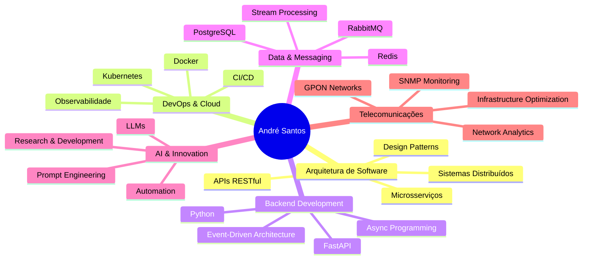

# Olá, eu sou André Santos!

  
  
  

---

## Sobre Mim

**Engenheiro de Software** com sólida experiência na concepção e desenvolvimento de **sistemas distribuídos de alta performance** para o setor de telecomunicações.

Meu foco principal é converter **desafios complexos de infraestrutura** em soluções tecnológicas **robustas, escaláveis e inteligentes**.

Atualmente coordeno projetos de **pesquisa e desenvolvimento** focados em Telecom e atuo como **consultor**, auxiliando empresas a projetarem sistemas resilientes e preparados para o futuro.

---

## Experiência Profissional

### **Virtex Telecom** - Engenheiro de Software

Liderei a arquitetura de projetos estratégicos que otimizaram significativamente as operações de rede da empresa:

#### **Arquitetura de Monitoramento SNMP Avançado**
- Desenvolvi um **ecossistema completo** de monitoramento baseado em SNMP traps
- Implementei **mensageria, microsserviços de processamento e APIs**
- **Revolucionou** a visibilidade da infraestrutura e capacidade de resposta proativa a incidentes

#### **Plataforma de Análise de Redes GPON**
- Projetei e implementei **arquitetura distribuída** para análise avançada de dados
- Habilitou **identificação de anomalias** e otimização de performance em larga escala
- Processamento de dados em **tempo real** com alta disponibilidade

---

## Stack Tecnológica

### **Arquitetura & Infraestrutura**

### **Backend & Desenvolvimento**

### **Inteligência Artificial & Dados**

### **Telecomunicações & Redes**

---

## Principais Competências

---

## Projetos em Destaque

| Projeto | Descrição | Tecnologias |
|------------|--------------|----------------|
| **SNMP Monitoring Ecosystem** | Sistema completo de monitoramento de infraestrutura com processamento em tempo real | `Python` `Kubernetes` `RabbitMQ` `SNMP` |
| **GPON Analytics Platform** | Plataforma distribuída para análise de redes GPON com detecção de anomalias | `Microservices` `Redis` `PostgreSQL` `ML` |
| **Telecom Infrastructure Optimizer** | Solução de otimização automatizada para operações de rede | `APIs` `Event-Driven` `Docker` `AI` |

---

## GitHub Stats

  
  
  
  
  

---

## Atualmente Explorando

- **Pesquisa & Desenvolvimento** em soluções Telecom de próxima geração
- **Integração de LLMs** em sistemas de infraestrutura
- **Cloud-Native Technologies** e arquiteturas serverless
- **Observabilidade Avançada** e AIOps

---

## Serviços de Consultoria

- **Arquitetura de Sistemas Distribuídos**  
- **Modernização de Infraestrutura**  
- **Otimização de Performance**  
- **Implementação de Monitoramento Avançado**  
- **Migração para Microsserviços**  
- **Integração de Soluções de IA**  

---

## Vamos Conectar!

---

  
  ### "Convertendo desafios complexos em soluções tecnológicas inteligentes"
  
  **Estou aberto a novas conexões e oportunidades para colaborar em projetos desafiadores que envolvam tecnologia de ponta.**
  
  
  

---

  

