# 👋 Olá, eu sou André Santos!

  
  
  

---

## 🚀 Sobre Mim

🔭 **Engenheiro de Software Pleno** com sólida experiência na concepção e desenvolvimento de **sistemas distribuídos de alta performance** para o setor de telecomunicações.

💡 Meu foco principal é converter **desafios complexos de infraestrutura** em soluções tecnológicas **robustas, escaláveis e inteligentes**.

🌟 Atualmente coordeno projetos de **pesquisa e desenvolvimento** focados em Telecom e atuo como **consultor**, auxiliando empresas a projetarem sistemas resilientes e preparados para o futuro.

---

## 🏢 Experiência Profissional

### 🔹 **Virtex Telecom** - Engenheiro de Software Pleno

Liderei a arquitetura de projetos estratégicos que otimizaram significativamente as operações de rede da empresa:

#### 📡 **Arquitetura de Monitoramento SNMP Avançado**
- Desenvolvi um **ecossistema completo** de monitoramento baseado em SNMP traps
- Implementei **mensageria, microsserviços de processamento e APIs**
- **Revolucionou** a visibilidade da infraestrutura e capacidade de resposta proativa a incidentes

#### 🌐 **Plataforma de Análise de Redes GPON**
- Projetei e implementei **arquitetura distribuída** para análise avançada de dados
- Habilitou **identificação de anomalias** e otimização de performance em larga escala
- Processamento de dados em **tempo real** com alta disponibilidade

---

## 🛠️ Stack Tecnológica

### 🏗️ **Arquitetura & Infraestrutura**

### 💻 **Backend & Desenvolvimento**

### 🤖 **Inteligência Artificial & Dados**

### 📡 **Telecomunicações & Redes**

---

## 📊 Principais Competências

```mermaid
mindmap
  root((André Santos))
    Arquitetura de Software
      Sistemas Distribuídos
      Microsserviços
      APIs RESTful
      Design Patterns
    
    DevOps & Cloud
      Kubernetes
      Docker
      CI/CD
      Observabilidade
    
    Backend Development
      Python
      FastAPI
      Async Programming
      Event-Driven Architecture
    
    Data & Messaging
      RabbitMQ
      Redis
      PostgreSQL
      Stream Processing
    
    AI & Innovation
      LLMs
      Prompt Engineering
      Automation
      Research & Development
    
    Telecomunicações
      SNMP Monitoring
      GPON Networks
      Network Analytics
      Infrastructure Optimization
```

---

## 🎯 Projetos em Destaque

| 🏆 Projeto | 📋 Descrição | 🚀 Tecnologias |
|------------|--------------|----------------|
| **SNMP Monitoring Ecosystem** | Sistema completo de monitoramento de infraestrutura com processamento em tempo real | `Python` `Kubernetes` `RabbitMQ` `SNMP` |
| **GPON Analytics Platform** | Plataforma distribuída para análise de redes GPON com detecção de anomalias | `Microservices` `Redis` `PostgreSQL` `ML` |
| **Telecom Infrastructure Optimizer** | Solução de otimização automatizada para operações de rede | `APIs` `Event-Driven` `Docker` `AI` |

---

## 📈 GitHub Stats

  
  
  
  
  

---

## 🌱 Atualmente Explorando

- 🔬 **Pesquisa & Desenvolvimento** em soluções Telecom de próxima geração
- 🤖 **Integração de LLMs** em sistemas de infraestrutura
- ☁️ **Cloud-Native Technologies** e arquiteturas serverless
- 📊 **Observabilidade Avançada** e AIOps

---

## 💼 Serviços de Consultoria

🔹 **Arquitetura de Sistemas Distribuídos**  
🔹 **Modernização de Infraestrutura**  
🔹 **Otimização de Performance**  
🔹 **Implementação de Monitoramento Avançado**  
🔹 **Migração para Microsserviços**  
🔹 **Integração de Soluções de IA**  

---

## 📫 Vamos Conectar!

---

  
  ### 🚀 "Convertendo desafios complexos em soluções tecnológicas inteligentes"
  
  **Estou aberto a novas conexões e oportunidades para colaborar em projetos desafiadores que envolvam tecnologia de ponta.**
  
  
  

---

  

